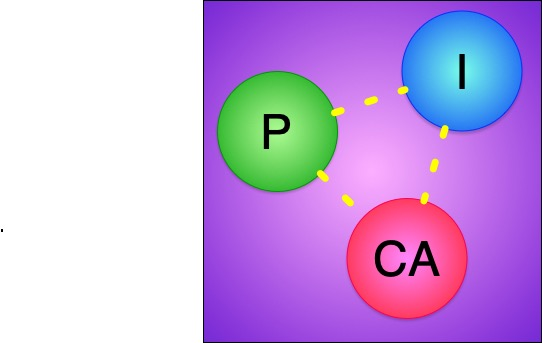

# Pica

At long last, Pica is my attempt to build a language loosely based on Pi calculus.

The idea underlying it is that we're using machines with lots of CPUs, and the only way to
take advantage of those CPUs is by doing lots of stuff in parallel. But the programming languages
that we use are very sequence-oriented. What if we build a language, from the ground up,
around parallelism?

I've written about an early version of the idea on 
[my blog](http://www.goodmath.org/blog/2007/05/13/process-declarations-in-pica/). You can see the origin
of my ideas, but what's written there is almost nothing like what I'm implementing here.
